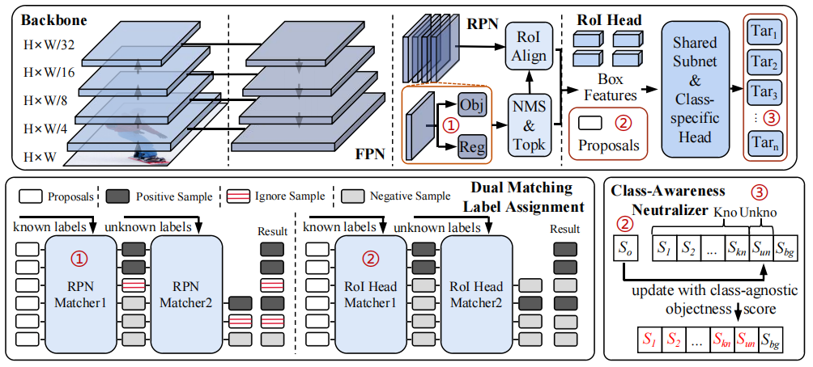

# KTCN: Enhancing Open-World Object Detection with <u>K</u>nowledge <u>T</u>ansfer and <u>C</u>lass-Awareness <u>N</u>eutralization

## Abstract
Open-World Object Detection (OWOD) has garnered widespread attention due to its ability to recall unannotated objects. Existing works generate pseudo-labels for the model using heuristic priors, which limits the model’s performance. In this paper, we leverage the knowledge of the large-scale visual model to provide supervision for unknown categories. Specifically, we use the Segment Anything Model (SAM) to generate raw pseudo-labels for potential objects and refine them through Intersection over Union (IoU) and the shortest bounding box side length. Nevertheless, the abundance of pseudo-labels still exacerbates the issue of competition in the one-to-many label assignment. To address this, we propose the Dual Matching Label Assignment (DMLA) strategy. Furthermore, we propose the Class-Awareness Neutralizer (CAN) to reduce the model’s bias towards known categories. Evaluation results on open-world object detection benchmarks, including MS COCO and Pascal VOC, show that our method achieves nearly double the unknown category recall rate of previous state-of-the-art (SOTA) methods, reaching 41.5 U-Recall. Additionally, our approach does not add any extra parameters, maintaining the inference speed advantage of Faster R-CNN, leading the SOTA methods based on deformable DETR at a speed of over 10 FPS.




## Installation
Our code based on Detectron2. Please follow the offfical [installation](https://detectron2.readthedocs.io/en/latest/tutorials/install.html)
```
python -m pip install 'git+https://github.com/facebookresearch/detectron2.git'
# (add --user if you don't have permission)

# Or, to install it from a local clone:
git clone https://github.com/facebookresearch/detectron2.git
python -m pip install -e detectron2

# On macOS, you may need to prepend the above commands with a few environment variables:
CC=clang CXX=clang++ ARCHFLAGS="-arch x86_64" python -m pip install ...
```

## Data Structure
```
datasets
    VOC2007         
        Annotations  # xml format
        ImageSets
            Main
                OWOD
                    all_task_test.txt
                    t1_train.txt
                    t2_train.txt
                    t2_ft.txt
                    t3_train.txt
                    t3_ft.txt
                    t4_train.txt
                    t4_ft.txt
        JPEGImages
            xxxx.jpeg
            ...
    SAM
        xxxx.json
        ...
```
## Quick Start
```
python run.py
```
## Evalution
```
# t1
python tools/train_net.py --config-files configs/t1/t1_train.yaml --eval-only --num-gpus 2 MODEL.WEIGHTS ...

# t2
python tools/train_net.py --config-files configs/t2/t2_ft.yaml --eval-only --num-gpus 2 MODEL.WEIGHTS ...

# t3
python tools/train_net.py --config-files configs/t3/t3_ft.yaml --eval-only --num-gpus 2 MODEL.WEIGHTS ...

# t4
python tools/train_net.py --config-files configs/t4/t4_ft.yaml --eval-only --num-gpus 2 MODEL.WEIGHTS ...
```

